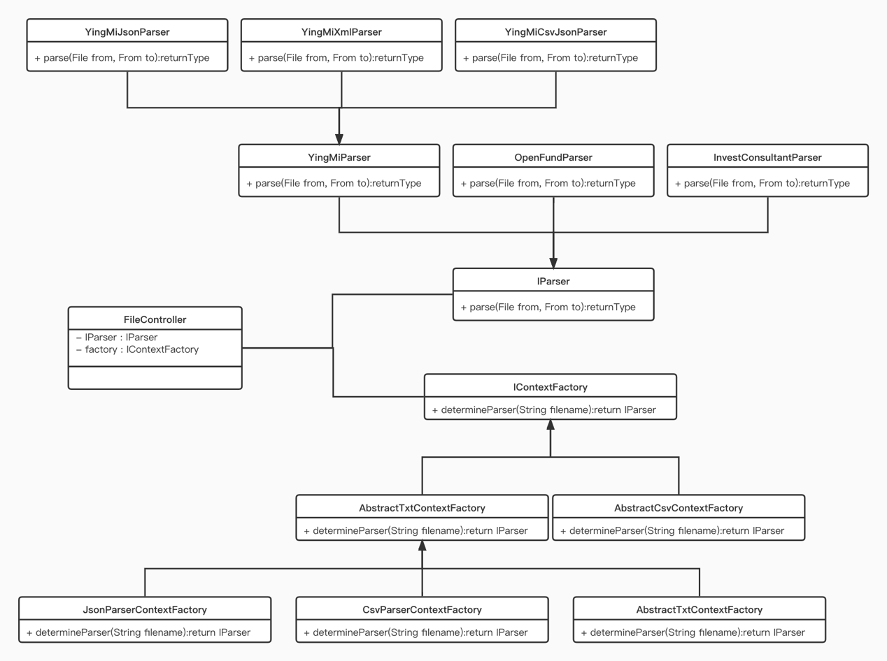

文件解析器设计

目录

[文件解析器设计](#_Toc92812131)

[背景](#背景)

[文件介绍](#文件介绍)

[开放式基金格式—按字符长度分割值（GBK编码）](#开放式基金格式按字符长度分割值gbk编码)

[投顾格式—以单元分隔符分割属性值](#投顾格式以单元分隔符分割属性值)

[盈米格式—以“｜”分割值](#盈米格式以分割值)

[需求分析](#需求分析)

[一、 权限管理](#权限管理)

[二、文件管理](#二文件管理)

[三、小组管理](#三小组管理)

[四、空间隔离](#四空间隔离)

[架构](#架构)

[Docker Bridge模式](#docker-bridge模式)

[Spring Security的工作原理](#spring-security的工作原理)

[文件上传流程](#文件上传流程)

[Http1.1之前的文件上传](#http11之前的文件上传)

[Http1.1断点续传](#http11断点续传)

[IO优化](#io优化)

[文件处理流程](#文件处理流程)

[多线程加速](#多线程加速)

[数据库设计](#数据库设计)

[问题与解决方案](#问题与解决方案)

# 背景

由于盈米业务需要蹲循国家证监会的接口协议，数据的交换需要通过TXT纯文本文件形式进行交互。目前，盈米交易平台需要涉及到三种格式，包括开放式基金业务数据格式、投顾业务数据交换交换格式以及盈米自定义的格式。三种格式的文件的内容各有各的组织形式，但都有一个点就是，肉眼难以区分出哪些值属于哪个字段的，并且每个文件都有着几十MB甚至上GB的大小，因此，查看此类文件有不小的困难，需要将其转换为诸如JSON、格式的数据组织形式，便于能眼睛直接分辨出数据。同时，随着业务的发展，可能后面还会出现除了TXT纯文本文件形式的其他文件，又要考虑到，不同的人习惯于看不同格式的文件，有些可能习惯于JSON，有些可能更加喜欢CSV格式。这就要需要解析器设计得灵活，兼顾后面业务的拓展以及不同人的使用感受。文件解析器项目因此产生。

# 文件介绍

三种文件都有文件头，标识了一些文件版本号、时间等信息。

### 开放式基金格式—按字符长度分割值（GBK编码）

文件第一行表明是开放式基金数据文件，第二行表示版本号，其他参考开放式基金接口协议文档。直到空行（包括空行，空行是因为这里值为空）都是文件头，接下来的一行00000122表示有122个字段，接下来122行表示属性的名称，接下来的一行表示有2978行记录，每行数据按接口协议文档中规定的长度分离出值，剩下所有都是数据记录，直到最后一行EOF。

### 投顾格式—以单元分隔符分割属性值

由于属性值之间采用单元分隔符分割值，使用文本文件查看器查看将不会看到单元分隔符。在vim下，可以观察到单元分隔符是\^_。其中第一行为文件头，拥有40860行数据（其他参考投顾格式接口文档）。下来是数据记录，属性名称需要参考投顾接口文档。

### 盈米格式—以“｜”分割值

文件第一行为文件头，最后的14772表示有14772行数据，接下来一行表示所有字段名称，以“｜”分隔，接下来是数据记录，注意到，某些字段的属性值本身就是一个JSON格式。

# 需求分析

整体用例图

### 权限管理

（一）、登录认证

1.  为了标识用户、保证用户的私密性，记录用户的文件数据、权限状态、小组情况数据，需要为每个用户设立一个唯一标识的账号，用户需要持密码登录，认证成功后才能对文件、小组、权限等内容的操作

2.  为了方便用户的使用，应该在用户合法登录后，七天内可以免密登录，每隔七天，要使用系统，都必须重新登录一次。

3.  系统内的操作，都只有用户登录后才能操作。在操作前，系统需要判断用户是否有用对应的权限，如果没有对应的权限，应该拒绝执行对应的操作。

（二）、权限管理

1.  考虑到不同人多的情况下，每个人/每个组负责的业务不同，为了每个人/每个组的被他人影响（例如，被误删）以及保密性问题，应当将负责内容不同的人/小组隔离开来。因此需要设置小组的管理。

2.  一个人可能同时属于多个小组。

3.  为了合理的管理小组，每个小组都可以被创建或者删除，同时为了应对组内人员的变更，需要随时可以添加成员、移除出小组。

4.  用户在不同的空间应当有不同上传权限，在个人空间以及组内个人空间内，用户应该具备所有操作权限，但在组内公共空间内，只有组长才有对组内公共空间和成员的组内个人空间的所有操作权限，组内成员之间无法操作成员组内个人空间。

5.  小组内，组长具有具有添加成员、移除成员的权限，组员无对应权限

6.  小组内，组长具有授权、撤权的权限

7.  小组内，组长具有对组内公共空间的所有文件具有所有权限

8.  小组内，组长具有对组内个人空间的所有文件具有所有权限

9.  小组内，小组成员对组内公共空间的文件具有创建文件夹、上传、下载、转换权限，但没有删除权限

10. 小组内，小组成员对组内个人空间有所有权限，但成员无法访问其他成员的组内个人空间的权限

## 二、文件管理

1.  小组内，默认情况下，组长可以对组内的文件进行任何操作

2.  小组内，默认情况下，小组成员可以进行创建文件夹、上传、下载、转换操作，但是，删除操作只有在权限授予的情况下才能进行。

3.  小组内，组长拥有的权限比成员要高。

4.  小组内，小组成员不能访问其他成员的组内个人空间，但组长可以；小组成员可以访问组内公共空间。

5.  用户在个人空间、组内个人空间内，可以对文件进行任何操作。

### 三、小组管理

1.  小组内，默认情况下，组长可以为组员授予组长拥有的任何一个权限

2.  小组内，默认情况下，组长可以添加成员、移除成员

3.  每个用户都可以创建小组

4.  每个小组只能由组长解散

### 四、空间隔离

1.  每个用户都有一个个人空间。

2.  每个用户在每个小组内都有一个组内个人空间。

3.  每个小组有一个组内公共空间。

# 架构

### Docker Bridge模式

Docker利用了Linux的网络namespace隔离技术，虚拟出来的网络可以等同于一个网络，如果不同网络之间没有联系，则这两个虚拟出来的网络不会互通。在Docker中，Bridge模式的网络工作原理类似于交换机，是一种利用软件实现的交换机。一个如上图的docker子网的请求会经过一下步骤：

1.  主机192.168.1.1发送一个请求到Bridge。

2.  Bridge查看网络IP地址是否为docker子网内部的IP

3.  如果是，且IP为192.168.1.2，则通过Bridge将请求转发至192.168.1.2

4.  如果不是，则通过端口映射关系（NAT地址转换），通过Bridge转发至主机端口，通过网卡，将请求发送出去。

### Spring Security的工作原理

由于Tomcat是面向Servlet的，在任何一个请求到达Servlet前，都可以配置n个过滤器对请求进行过滤，因此我们可以将诸如验证是否登录的一些操作，放到过滤器里面。然而在SpringMVC项目中，所有操作都是围绕一个叫DispatchServlet的东西进行编程的。这时，Filter就不能完成所有过滤操作。因为，Filter是在Servlet组件之外的组件，而Controller作为Servlet的一部分，假设DispatchServlet中有两个Controller，Controller1的执行要求有权限A，但是Controller2的执行不要求权限A，如果将Controller1的过滤放到Filter中，将对Controller2的执行产生影响，因此，对于Controller1与Controller2的跟业务相关的过滤任务，放到各自业务代码的前面，这样就不会互相产生影响。这个也是动态代理的在spring
security中的应用。Spring
Security利用Filter以及动态代理技术，对请求进行了一些权限、安全等的验证。

Spring
Security的中只有一个Filter，这个Filter做了使用了代理模式，如上图，上图中的Servlet为DispatchServlet。

以上传文件为例，上传前需要登录，处理过程如下：

1.  首先，一个请求到达服务端时，在到达Servlet执行业务代码之前，会经过一系列的Filter

2.  其中有一个是判断是否登录的Filter

3.  如果登录，运行步骤4，没有则跳转到登录页面，登录后返回Cookie，Cookie中带有JWT，下次请求时会自动带上JWT表明身份。

4.  已经登陆，将认证结果Authentication通过SecurityContext保存在线程当中，其中SecurityContext继承了ThreadLocal类，内部的数据只有当前线程能访问，即Authentication只能由当前线程访问，由于每一个请求都是一个线程，因此ThreadLocal保证了不同请求的数据隔离。

5.  在执行业务代码时，可以通过获得SecurityContext获取当前用户的信息。

综合上面的介绍，下面是一个项目的架构图

文件解析器中设置了三个docker容器，并且在docker内部创建了一个bridge模式的子网，子网内有三个容器，其中Web前端与Nginx组成一个容器，SpringBoot后端为一个容器，MySQL为一个容器。一个请求的完整处理过程如下：

1.  用户在点击链接时，请求会发送到Nginx容器

2.  Nginx容器根据匹配原则，将前端HTML等静态资源返回到浏览器

3.  浏览器执行HTML和JavaScript的解析

4.  解析过程需要发送请求到SpringBoot后端

5.  在到达DispatcherServlet之前，会经过Spring Security的验证过滤

6.  经过验证后，符合要求的请求会到达DispatcherServlet，经过HandlerMapping匹配到具体的Controller

7.  到达Controller后，需要执行前置代理增强，则先执行前置增强，如@PreAuthorize()

8.  执行业务代码

9.  数据库增删改查

10. 执行后置增强

# 文件上传流程

Http1.1中新增了一个特性—断点续传。这个特性的作用是，在使用http传输大资源时，可以将大的资源分为若干个小资源，再分别传输，若某个小资源在传输出现错误时，只需要重传这个小资源，而不必要重传整个大的资源。利用这个特性，实现了大文件的断点续传。

### Http1.1之前的文件上传

这种处理方式直接读取文件数据流，经过网络直接发送到服务器。这种方式有缺点明显：实现相对简单，但是文件传输出现错误时需要重传整个文件。因此适合应用在传输资源不大的场景。

### Http1.1断点续传

处理步骤如下：

1.  将文件分成若干个文件分片

2.  对文件的内容进行hash散列，得到唯一散列值，只有文件内容一样的时候hash值才会一样

3.  以hash值命名文件分片

4.  分别上传文件分片

5.  所有分片文件上传完成之后，发送一个融合文件的请求，并附带所有hash值

6.  服务器根据hash值将所有文件分片合并成原来的文件

# IO优化

传统IO：

传统IO为上图中蓝色线，从图中可以看出，文件上传经过了多次用户态，同时多了很多次无用的数据复制，因为文件上传不需要修改数据，数据不需要复制到用户空间。

NIO：

数据从网卡传到内核空间后，直接从Socket缓冲区复制到文件缓冲区，再写入磁盘。少了几次经过用户空间的步骤，也因此少了几次无用的复制。因此提高效率

# 文件处理流程

为了程序的拓展性，采用了简单工厂模式以及策略模式，设计出分析程序，支持两处拓展，后面需要实现接口，在不修改原来的代码，或者只需修改少量代码的情况下就能实现新的支持。两处拓展如下：

1.  目前只需要解析TXT纯文本文件，未来，可能需要解析CSV、JSON格式的文件，这是工厂的职责，只需要继承抽象类，实现新的工厂，负责新的文件格式就可以。例如，创建新的CSV工厂、JSON工厂

2.  每个人的喜好不同，解析器应该支持解析成不同的目标格式。这是解析器的职责。工厂会根据需要读取配置文件以及用户想要转换成的格式，生成一个解析器，这个解析器的细节根据不同的格式有不同的实现，例如TXT解析器将文件解析成TXT格式，JSON解析器将文件解析成JSON格式。

具体类图如下：

该程序的设计思路如下：

1.  IContextFactory负责源文件的处理，IParser负责目标文件的处理

2.  当需要支持新的源文件时，就根据需要实现接口或者抽象类；当需要支持新的目标文件类型的时候，可以根据需要实现接口或者抽象类。

3.  IContextFactory负责生成IParser，IParser具体文件的解析。

4.  当前的实现是通过源文件的名字来辨别生成什么工厂。

# 多线程加速

线程池采用生产者消费者模式，生产线程负责读取文件的数据，消费线程负责将数据进行转换，并写入新的文件。同时，消费线程返回的结果会放到结果队列中，主线程负责消费处理结果。

最总经过调试，可以将当线程执行处理时间6分钟降至多线程处理2分半钟，并且一条生产线程、一条消费线程的情况下就能达到了最好。

# 数据库设计

# 问题与解决方案

在创建docker网络的过程中，会出现此问题：docker子网中的IP会跟当前主机所在的局域网IP冲突，如果想要访问主机所在局域网的那台服务器，该如何访问。

解决方案一：修改docker容器的IP

缺点：由于局域网内部使用的IP可能是由DHCP动态租借的，经过一段时间后，容器IP仍然有可能与局域网冲突。

解决方案二：通过访问局域网NAT网关

优点：无论内部IP怎么变，NAT网关的地址都不会变，同时，网关知道内部所有主机的IP，无论怎么变化。因此，访问网关是最灵活的一种方案。

在前后端分离的项目中出现的跨域问题（上图）：

1.  用户在合法登录网站A的情况下，A服务器返回了cookie

2.  用户不小心访问了B，B网页附带恶意JavaScript代码，在用户不知情的情况下，发送转账请求。

3.  由于是用户的浏览器发送的，该转正请求因此附带了A的cookie

4.  A网站收到的请求，查看了cookie正确之后，认为是用户的操作，便会执行逻辑

5.  用户因此损失了财物。

由于跨域会出现上述情况，浏览器有了同源策略：当前所在的网址协议、域名、端口必须与发送请求的协议、域名、端口一致，否则，不允许发送请求。由于该同源策略，我们无法发送请求。

解决方案一：修改前端发送请求的代码，使协议、域名、端口一致。

缺点：网站在发展越来越大的情况下，会不只一个域名、协议、端口，该方法不能解决所有跨域问题

方案二：允许发送跨域请求

在没有安全问题的情况下，设置允许发送跨域请求。

原本写的代码：多线程同时写入文件时，某一个线程写入数据出错，当前线程会通知线程池、并把文件删掉。此时会出现类似于雪崩的情况，由于该线程把文件删了，导致其他线程无法找到文件，所有线程都会出错。

正确的解决方案是无论线程是否执行成功，都可以返回一个结果，当返回结果出现错误时，主线程停止线程池，再删除文件。

但是这样会出现新的问题：一个拥有500万个数据的文件，就有500万个处理结果，如果JVM同时维护这500万个结果，会容易出现OOM。因此需要及时将结果处理掉，让JVM及时GC。
